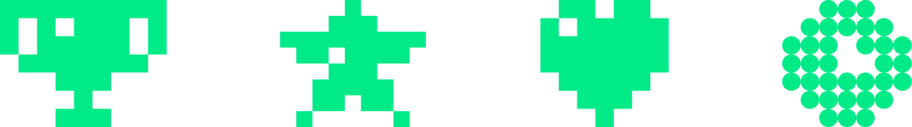

# yandex_CodeRun

 
    

 

### Задачи
| # |      Название       | Уровень| Паттерн |
|:-:|:-------------------:|:---:|:-------:|
| 1 |      Гвоздики       | $\textcolor{#2db49d}{\textsf{Легкая}}$  |       dynamic programming 1D        |

### Сезоны

| # |      Название       | Период |
|:-:|:-------------------:|:-------:|
| 1 | Первый сезон | 7 апреля ⸺ 7 июля 2023 |
